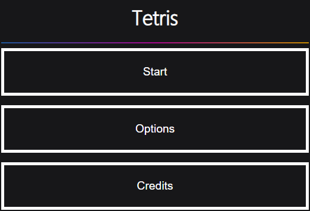

# Tetris
## Gettings started
### Installation

Simple unpack the folder and safe it where ever you like. 

It should look like this: 

  

Now doubleclick on index.html 

Your main browser will open up and will show you the menu.

  

