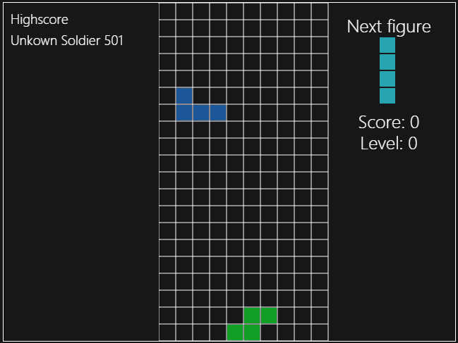

# Tetris
## Gettings started
### Installation
Simple unpack the folder and safe it where ever you like. 

<b> Folder: </b>

  

After the installation doubleclick on index.html to open the Main Menu 

Now click on the 2nd Button with the label "Options". In here you can give yourself a name. 

If this Textfield is empty the default name is "Unknown Soldier"

<b> Options: <b>

  

Finally you can start the game :)

In order to do that you have to go back to the Main Menu and click on the Button "Start".

<b> Ingame: <b>

  

  
### How to play
<b> Controls: </b>
<strong>↑</strong> - Rotate 90° Clockwise

<strong>↓</strong> - Fast Drop

<strong>←</strong> - Move Piece one to the Left

<strong>→</strong> - Move Piece one to the Right

<strong>ESC</strong> - Toggle Menu

<b> Score: </b>
To reach the maximum points you have to clear multiple lines with one figure.

One line cleared = 40 Points

Two line cleared = 100 Points

Three line cleared = 300 Points

Four line cleared = 1200 Points

